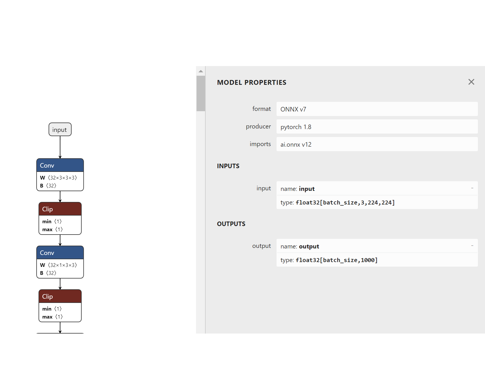
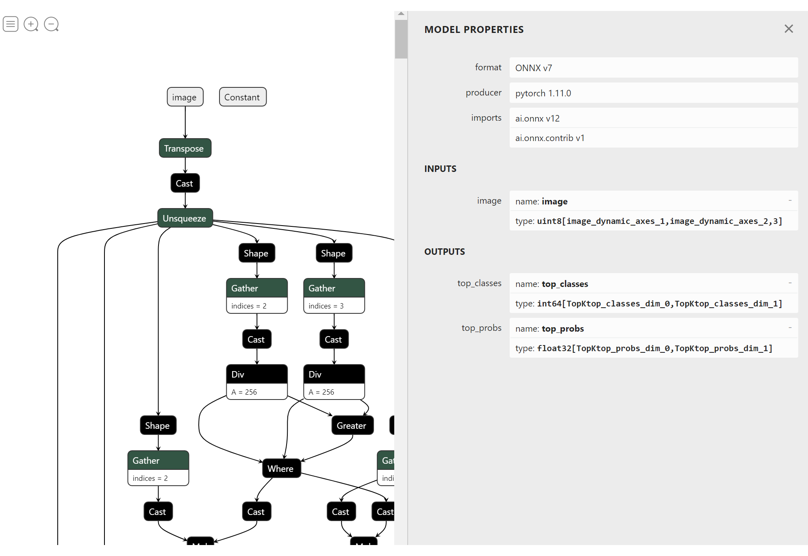

# Image classification using an augmented ONNX model

This samples uses the utilities in [ONNX Runtime extensions](https://github.com/microsoft/onnxruntime-extensions) to augment the MobileNetV2 model to include the data pre and post processing operations required by the model.

The model augmentation code uses Python and PyTorch and is contained in the `model` directory.

A simple C# console application to make predictions with the augmented model is contained in this directory.

## Pre-requisites

* Install cmake
* Install gcc for your platform
* Install conda
* Create a conda environment
* Install onnxruntime-extension package from source: python -m pip install git+https://github.com/microsoft/onnxruntime-extensions.git

## Augment the MobileNetV2 model

Base model: https://github.com/onnx/models/blob/main/vision/classification/mobilenet/model/mobilenetv2-12.onnx?raw=true

As you can see from the following image from netron, the input to the original model is a four dimensional float32 tensor, the dimensions of which are batch, RGB color index, image height and width.

The output of the model is the batch as well as list of scores for the 1000 different classes of the model.

### Preprocessing

The pre processing for the MobileNet model consists of the following steps: resize, center and normalize

### Postprocessing

The post processing of the MobileNet model consists of taking the scores for each of the classes and transforming them into the top 10 class ids and corresponding top 10 probabilities.

### Augmented model

A snippet from the augmented model is shown below. The input is a single image of variable size, and the output is the top 10 classes and their associated scores.

## Run the model

This sample has two ways that you can run the model. 

### Python API

The Python code in `model/test_model.py` runs the augmented model using the ONNX Runtime Python API. This code is used to test the model augmentation process.

### C# Console Application

The C# code in `Program.cs` uses the ONNX Runtime C# API to run the augmented model.
