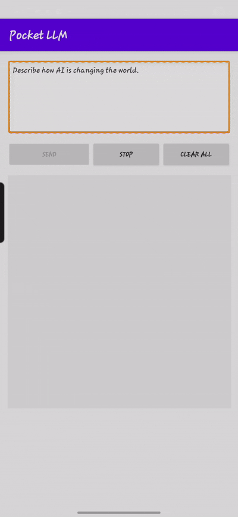
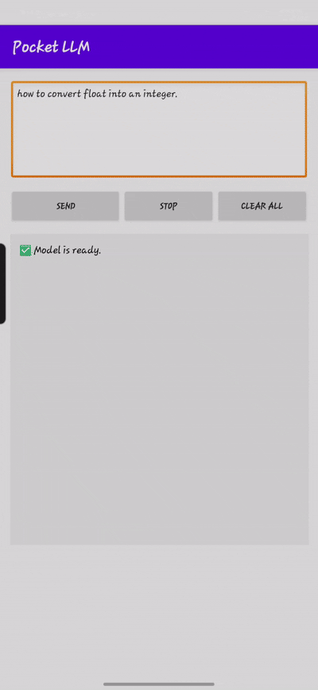
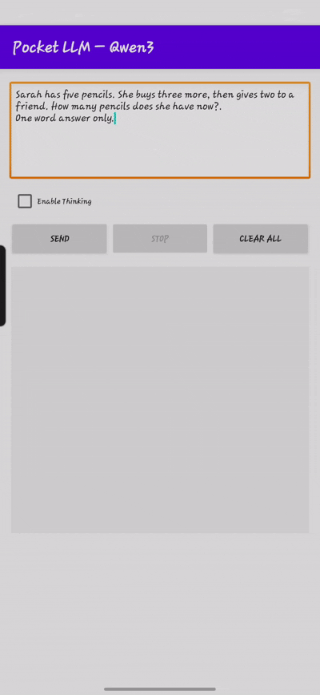

# Local Qwen LLM on Android

This example shows how to run Qwen2.5-0.5B-Instruct and Qwen3-0.6B entirely on an Android device using ONNX Runtime.
All tokens are generated offline on the phone no network calls, no telemetry.

---

## Key features

- On-device inference with the official onnxruntime-android.
- Tokenizer compatibility – reads the Hugging Face-standard tokenizer.json shipped with Qwen.
- Prompt formatting for Qwen 2.5 and Qwen 3, including the **Thinking Mode** toggle supported by Qwen3.
- Streaming generation with past-KV caching for smooth, low-latency text output (see [OnnxModel.kt](app/src/main/java/com/example/local_llm/OnnxModel.kt)).
- Output supports Markdown — copy and reuse formatted answers anywhere.


---

## 📸 Inference Preview

<p align="center">
  
  
  
</p>

<p align="center">
  <em>Figure: App interface showing prompt input and generated answers using the local LLM.</em>
</p>

---

## Model Info

This app supports both **Qwen2.5-0.5B-Instruct** and **Qwen3-0.6B** — optimized for instruction-following, QA, and reasoning tasks.

### Option 1: Use Preconverted ONNX Model

Download the `model.onnx` and `tokenizer.json` from Hugging Face:

- 🔹 [Qwen2.5](https://huggingface.co/onnx-community/Qwen2.5-0.5B-Instruct)  
- 🔹 [Qwen3](https://huggingface.co/onnx-community/Qwen3-0.6B-ONNX)  

- You can also use quantized models (e.g., `model_q4fp16.onnx`) for faster, lighter inference with minimal accuracy loss.

### ⚙️ Option 2: Convert Model Yourself

```bash
pip install optimum[onnxruntime]
# or
python -m pip install git+https://github.com/huggingface/optimum.git
```

Export the model:

```bash
optimum-cli export onnx --model Qwen/Qwen2.5-0.5B-Instruct qwen2.5-0.5B-onnx/
```

- You can also convert any fine-tuned variant by specifying the model path.
- Learn more about [Optimum here](https://huggingface.co/docs/optimum/main/en/index).

---

## ⚙️ Requirements

- [Android Studio](https://developer.android.com/studio)
- [ONNX Runtime for Android](https://github.com/microsoft/onnxruntime-genai/releases) (already included in this repo).
- A physical Android device for deployment and testing, ≥ 4 GB RAM for FP16 / Q4 models, ≥ 6 GB RAM for FP32 models.
- Real hardware preferred—emulators are acceptable for UI checks only.

---
#### Choose which Qwen model to run

In[MainActivity.kt](app/src/main/java/com/example/local_llm/MainActivity.kt) you will find two pre-defined `ModelConfig` objects:

```kotlin
val modelconfigqwen25 = …   // Qwen 2.5-0.5B
val modelconfigqwen3  = …   // Qwen 3-0.6B
````
Right below them is a single line that tells the app which one to use:

````kotlin
val config = modelconfigqwen25      // ← change to modelconfigqwen3 for Qwen 3
````

## How to Build & Run

1. Open Android Studio and create a new project (Empty Activity).
2. Name your app `local_llm`.
3. Copy all the project files from `Qwen_QA/Android` into the appropriate folders.
4. Place your `model.onnx` and `tokenizer.json` in:
   ```
   app/src/main/assets/
   ```
5. Connect your Android phone using wireless debugging or USB.
6. To install:
   - Press Run ▶️ in Android Studio, **or**
   - Go to **Build → Generate Signed Bundle / APK** to export the `.apk` file.
7. Once installed, look for the **Pocket LLM** icon&nbsp;
   
   on your home screen.

**Note**: All Kotlin files are declared in the package com.example.local_llm, and the Gradle script sets applicationId "com.example.local_llm".
If you name the app (or change the package) to anything other than local_llm, you must refactor:
- The directory structure in app/src/main/java/...,                     
- Every package com.example.local_llm line, and
- The applicationId in app/build.gradle.
- Otherwise, Android Studio will raise “package … does not exist” errors and the project will fail to compile.
----

## Customize Your App Experience with These
- Define the assistant’s tone and role by setting defaultSystemPrompt (in your model config).
- Adjust TEMPERATURE to control response randomness — lower for accuracy, higher for creativity ([OnnxModel.kt](app/src/main/java/com/example/local_llm/OnnxModel.kt)).
- Use REPETITION_PENALTY to avoid repetitive answers and improve fluency ([OnnxModel.kt](app/src/main/java/com/example/local_llm/OnnxModel.kt)).
- Change MAX_TOKENS to limit or expand the length of generated replies ([OnnxModel.kt](app/src/main/java/com/example/local_llm/OnnxModel.kt)).

### 📄 License Notice
Note: These ONNX models are based on Qwen, which is licensed under the [Apache License 2.0](https://huggingface.co/Qwen/Qwen2.5-0.5B-Instruct/blob/main/LICENSE).