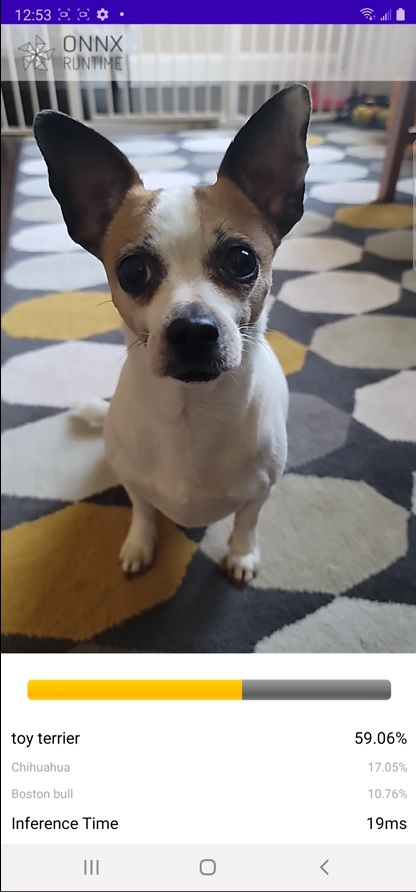

# ONNX Runtime Mobile image classification Android sample application

## Overview
This is an example application for [ONNX Runtime](https://github.com/microsoft/onnxruntime) on Android. The demo app uses image classification which is able to continuously classify the objects it sees from the device's camera in real-time and displays the most probable inference results on the screen.

This example is loosely based on [Google CodeLabs - Getting Started with CameraX](https://codelabs.developers.google.com/codelabs/camerax-getting-started)

### Model
We use pre-trained [TorchVision MOBILENET V2](https://pytorch.org/hub/pytorch_vision_mobilenet_v2/) in this sample app.

## Requirements
- Android Studio 4.1+ (installed on Mac/Windows/Linux)
- Android SDK 29+
- Android NDK r21+
- Android device with a camera in [developer mode](https://developer.android.com/studio/debug/dev-options) with USB debugging enabled

## Build And Run

### Step 0. [Optional] Prepare the ORT models
Open [Mobilenet v2 Quantization with ONNX Runtime Notebook](https://github.com/microsoft/onnxruntime-inference-examples/blob/main/quantization/notebooks/imagenet_v2/mobilenet.ipynb), this notebook will demonstrate how to,
1. Export the pre-trained MobileNet V2 FP32 model from PyTorch to a FP32 ONNX model
2. Quantize the FP32 ONNX model to an uint8 ONNX model
3. Convert both FP32 and uint8 ONNX models to ORT models

Note: this step is optional, you can download the FP32 and uint8 ORT models [here](https://onnxruntimeexamplesdata.z13.web.core.windows.net/mobilenet_v2_ort_models.zip).

### Step 1. Clone the ONNX Runtime Mobile examples source code and download required model files
Clone this GitHub repository to your computer to get the sample application.

Put the labels file and models into the sample application resource directory:
- Download the labels file [here](https://raw.githubusercontent.com/pytorch/hub/master/imagenet_classes.txt)
- Copy MobileNetV2 ORT models and the labels file to `mobile/examples/image_classification/android/app/src/main/res/raw/`
- Alternatively, you can run `mobile/examples/image_classification/android/download_model_files.sh` to download the labels file and models to the sample application resource directory.

Then open the sample application in Android Studio. To do this, open Android Studio and select `Open an existing project`, browse folders and open the folder `mobile/examples/image_classification/android/`.

### Step 2. Build the sample application in Android Studio

Select `Build -> Make Project` in the top toolbar in Android Studio and check the projects has built successfully.

### Step 3. Connect your Android Device and run the app

Connect your Android Device to the computer and select your device in the top-down device bar.

Then Select `Run -> Run app` and this will prompt the app to be installed on your device.

Now you can test and try by opening the app `ort_image_classifier` on your device. The app may request your permission for using the camera.

#
Here's an example screenshot of the app.

