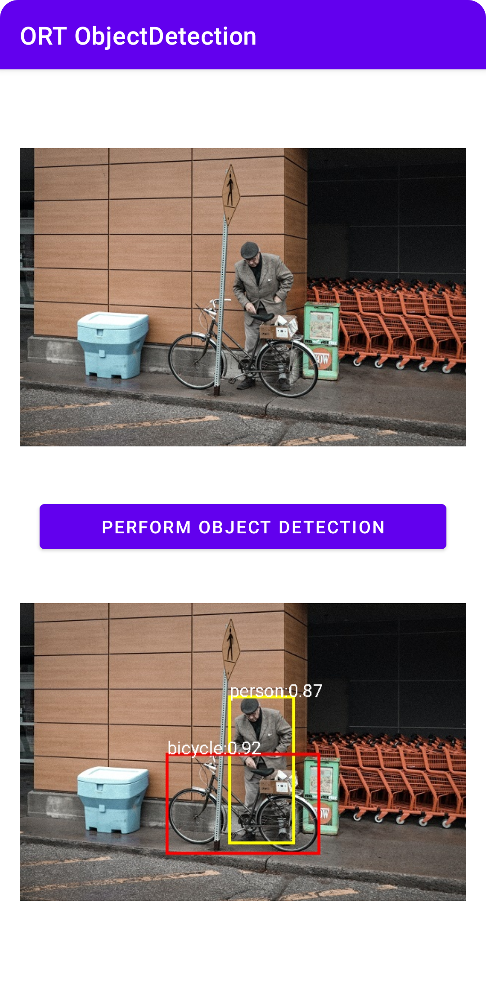
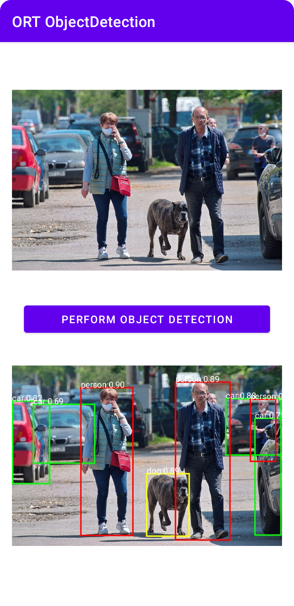

# ONNX Runtime Mobile Object Detection Android sample application with Ort-Extensions support for pre/post processing

## Overview

This is a basic Object Detection sample application for [ONNX Runtime](https://github.com/microsoft/onnxruntime) on Android with [Ort-Extensions](https://github.com/microsoft/onnxruntime-extensions) support for pre/post processing. The demo app accomplishes the task of detecting objects from a given image.

The model used here is from source: [Yolov8 in extensions](https://github.com/microsoft/onnxruntime-extensions/blob/64f20828ce0291394886e277c23529cd1d11320d/tutorials/yolo_e2e.py#L37) and with pre/post processing support.

This model (Yolov8n) can be fed with image bytes directly and outputs the detected objects with bounding boxes.

### Requirements
- Android Studio Dolphin | Android Studio Electric Eel | 2022.1.1 Patch 2+ (installed on Mac/Windows/Linux)
- Android SDK 29+
- Android NDK r22+
- An Android device or an Android Emulator

### Steps to build and run

### Step 1: Clone the ONNX runtime mobile examples source code

Clone this repository to get the sample application. Then open the project under the folder `mobile\examples\object_detection\android`.

### Step 2: Prepare the model

- The model used is under `mobile\examples\object_detection\android\app\src\main\res\raw`.

### Step 3: Connect Android Device and Run the app
  Connect your Android Device to your computer or select the Android Emulator in Android Studio Device Manager.

  Then select `Run -> Run app` and this will prompt the app to be built and installed on your device or emulator.

  Now you can try and test the object detection Android app by clicking the perform action button. Try to click the button multiple times to see the different results.

#
Here are some sample example screenshots of the app.

