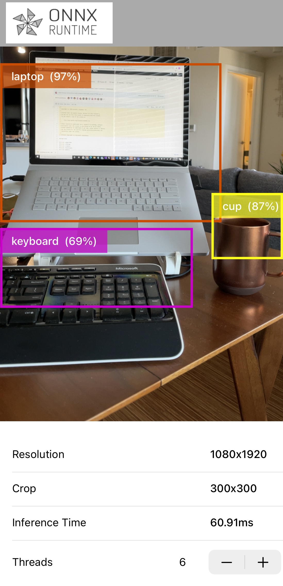

# ONNX Runtime Mobile object detection iOS sample application

This is an example app using object detection which is able to continuously detect the objects in the frames seen by your iOS device's back camera and display the detected object bounding boxes, detected class and corresponding inference confidence on the screen.

This example is heavily based on [Google Tensorflow lite - Object Detection Examples](https://github.com/tensorflow/examples/)

### Model
We use pre-trained quantized MobileNet SSD V1 model in this sample app. 

The original `ssd_mobilenet_v1.tflite` model can be downloaded [here](https://www.tensorflow.org/lite/examples/object_detection/overview#get_started)

## Requirements
- Install Xcode 12.5 and above (preferably latest version)
- A valid Apple Developer ID
- A real iOS device with a camera (preferably iphone 12/iphone 12 pro)
- Xcode command line tools `xcode-select --install`
- Clone the `onnxruntime-inference-examples` source code repo

## Build And Run

1. Install CocoaPods. `sudo gem install cocoapods`

2. Run `pod install` to generate the workspace file under `<ONNXRuntime-inference-example-root>/mobile/examples/object_detections/ios/`. 
- At the end of this step, you should get a file called `ORTObjectDetection.xcworkspace`.

3. Run download script `download.sh` under `<ONNXRuntime-inference-example-root>/mobile/examples/object_detections/ios/ORTObjectDetection/`. The script will download an original tf model along with the model metadata `labelmap.txt` and convert the model to onnx and then further convert it to ort format model (the format can be executed on mobile applications).
- At the end of this step, you should get a directory `ModelsAndData` which contains the ort format model `ssd_mobilenet_v1.all.ort` and model label data file `labelmap.txt`.

4. Open `ORTObjectDetection.xcworkspace` in xcworkspace and make sure to select your corresponding development team under `Target-General-Signing` for a proper codesign procedure to run the app.

5. Connect your iOS device, build and run the app. You'll have to grant permissions for the app to use the device's camera.

### iOS App related information

This app uses [ONNX Runtime Objective-C API](https://www.onnxruntime.ai/docs/reference/api/objectivec-api.html) for performing object detection functionality.

It is written entirely in Swift and uses a bridgingheader file for the framework to be used in a Swift app.

### Related Resources
- [Converting SSD Mobilenet from Tensorflow to ONNX](https://github.com/onnx/tensorflow-onnx/blob/master/tutorials/ConvertingSSDMobilenetToONNX.ipynb). 

- [Convert ONNX models to ORT format](https://www.onnxruntime.ai/docs/how-to/mobile/model-conversion.html#converting-onnx-models-to-ort-format)

#
Here's an example screenshot of the app:

