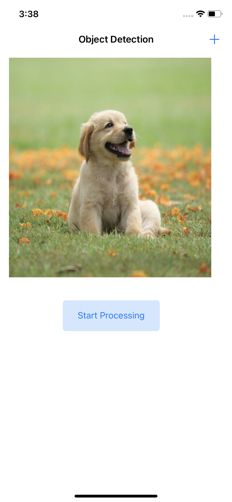
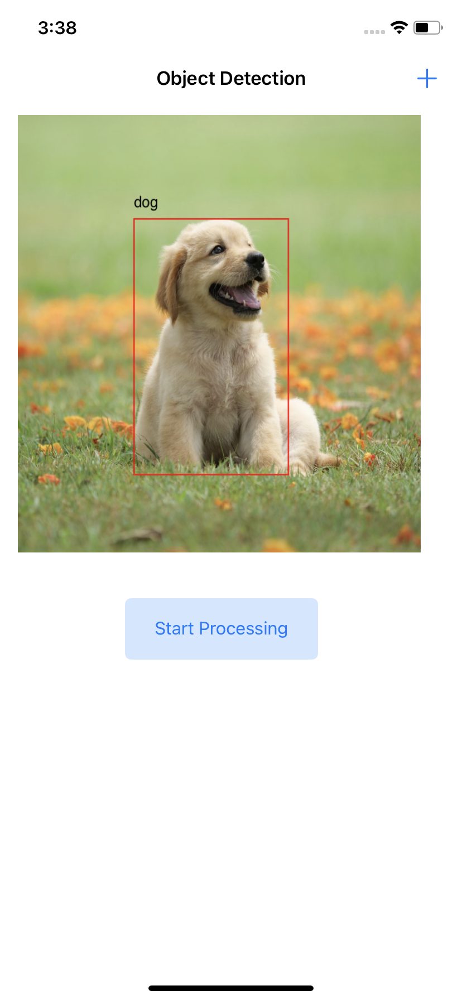

## ONNX Runtime Mobile object detection iOS sample application

This sample application makes use of Yolov8 object detection model to identify objects in images and provides identified class, bounding boxes and score as a result.

### Model
We use pre-trained yolov8 model in this sample app. The original yolov8n.pt model can be downloaded. [Here](https://github.com/ultralytics/assets/releases/download/v8.1.0/yolov8n.pt)  
- We converted this yolov8n.pt model to yolov8n.onnx using https://docs.ultralytics.com/modes/export/#usage-examples  
- Generated yolov8n.ort from yolov8n.onnx using https://onnxruntime.ai/docs/performance/model-optimizations/ort-format-models.html#convert-onnx-models-to-ort-format

### Requirements
- Install Xcode 12.5 and above (preferably latest version)

### Steps to build and run

#### Step 1: Clone the ONNX runtime mobile examples source code

Clone this repository to get the sample application. Then open the project under the folder `mobile\examples\object_detection_yolov8\ios`.

#### Step 2: Install app

1. In terminal, run pod install under onnxruntime-object-detection-yolo-ios/yolo-ios to generate the workspace file.
   - At the end of this step, you should get a file called yolo-ios.xcworkspace.
2. Open onnxruntime-object-detection-yolo-ios/yolo-ios/yolo-ios.xcworkspace in Xcode and make sure to select your corresponding development team under Target-General-Signing for a proper codesign 

#### Step 3: Connect IOS Device and Run the app
  Connect your IOS Device to your computer or select the IOS Simulator in Xcode.

  Then after running this app it will be installed on your device or simulator.

  Now you can try and test the object detection IOS app by 
  1. Click the "+" button from top, it will open your photo album, pick any   image that you want to test.
  2. Your selected image will be shown on the screen. Then click the "Start Processing" button, and it will begin identifying objects in the image/photo. The loader will appear on the screen while the image is being processed.
  3. After completion, you'll see an image with bounding boxes and the identified class name.

#
Here are some sample example screenshots of the app.

