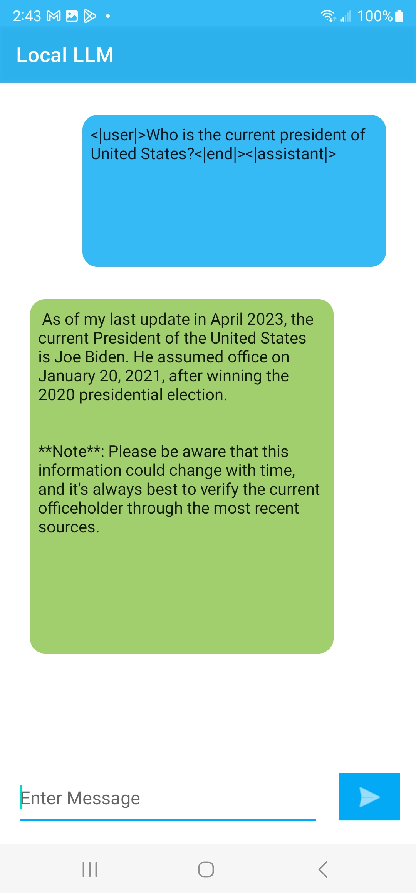
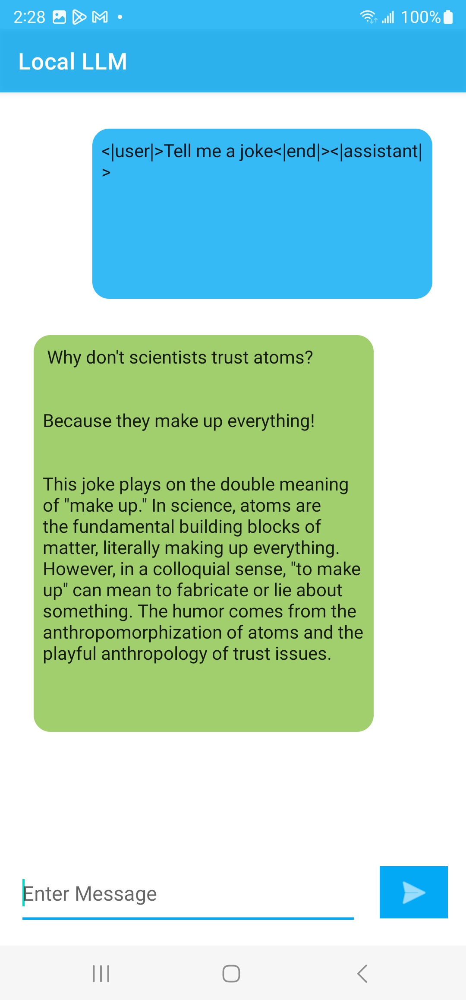
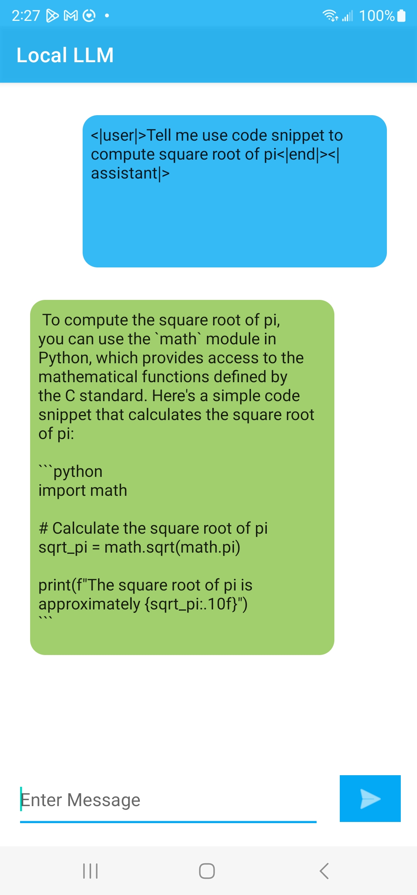

# Local Chatbot on Android with Phi-3 Vision, ONNX Runtime Mobile and ONNX Runtime Generate() API

## Overview

This is a basic [Phi-3 Vision](https://huggingface.co/microsoft/Phi-3-vision-128k-instruct-onnx-cpu) Android example application using [ONNX Runtime mobile](https://onnxruntime.ai/docs/tutorials/mobile/) and [ONNX Runtime Generate() API](https://github.com/microsoft/onnxruntime-genai) with support for efficiently running generative AI models. This tutorial will walk you through how to download and run the Phi-3 Vision App on your own mobile device and help you incorporate Phi-3 Vision into your own mobile developments. 

### Capabilities
[Phi-3 Vision](https://huggingface.co/microsoft/Phi-3-vision-128k-instruct-onnx-cpu) is a multimodal model incorporating imaging into [Phi-3's](https://huggingface.co/microsoft/Phi-3-mini-4k-instruct) language input capabilities. This expands Phi-3's usages to include Optical Character Recognition (OCR), image captioning, table parsing, and more. 

## Important Features

### Java API
This app uses the [generate() Java API's](https://github.com/microsoft/onnxruntime-genai/tree/main/src/java/src/main/java/ai/onnxruntime/genai) GenAIException, Generator, GeneratorParams, Images, Model, MultiModalProcessor, NamedTensors, and TokenizerStream classes ([documentation](https://onnxruntime.ai/docs/genai/api/java.html)). The [generate() C API](https://onnxruntime.ai/docs/genai/api/c.html), [generate() C# API](https://onnxruntime.ai/docs/genai/api/csharp.html), and [generate() Python API](https://onnxruntime.ai/docs/genai/api/python.html) are also available.

### Model Downloads
This app downloads the [Phi-3 Vision](https://huggingface.co/microsoft/Phi-3-vision-128k-instruct-onnx-cpu) model through Hugging Face. To use a different model, change the path links to refer to your chosen model.
```java
final String baseUrl = "https://huggingface.co/microsoft/Phi-3-vision-128k-instruct-onnx-cpu/resolve/main/cpu-int4-rtn-block-32-acc-level-4/";
List<String> files = Arrays.asList(
    "genai_config.json",
    "phi-3-v-128k-instruct-text-embedding.onnx",
    "phi-3-v-128k-instruct-text-embedding.onnx.data",
    "phi-3-v-128k-instruct-text.onnx",
    "phi-3-v-128k-instruct-text.onnx.data",
    "phi-3-v-128k-instruct-vision.onnx",
    "phi-3-v-128k-instruct-vision.onnx.data",
    "processor_config.json",
    "special_tokens_map.json",
    "tokenizer.json",
    "tokenizer_config.json");
```
These packages will only need to be downloaded once. While editing your app and running new versions, the downloads will skip since all files already exist.
```java
if (urlFilePairs.isEmpty()) {
    // Display a message using Toast
    Toast.makeText(this, "All files already exist. Skipping download.", Toast.LENGTH_SHORT).show();
    Log.d(TAG, "All files already exist. Skipping download.");
    model = new Model(getFilesDir().getPath());
    multiModalProcessor = new MultiModalProcessor(model);
    return;
}
```
### Crash Prevention
Downloading the packages for the app on your mobile device takes ~15-30 minutes depending on which device you are using. The progress bar indicates what percent of the downloads are completed. 
```java
public void onProgress(long lastBytesRead, long bytesRead, long bytesTotal) {
    long lastPctDone = 100 * lastBytesRead / bytesTotal;
    long pctDone = 100 * bytesRead / bytesTotal;
    if (pctDone > lastPctDone) {
        Log.d(TAG, "Downloading files: " + pctDone + "%");
        runOnUiThread(() -> {
            progressText.setText("Downloading: " + pctDone + "%");
        });
    }
}
```
Because the app is initialized when downloads start, the 'send' button for prompts is disabled until downloads are complete to prevent crashing.
```java
if (model == null) {
    // if the edit text is empty display a toast message.
    Toast.makeText(MainActivity.this, "Model not loaded yet, please wait...", Toast.LENGTH_SHORT).show();
    return;
}
```
### Multimodal Processor
Since we are using Phi-3 Vision, we refer to the [MultiModalProcessor Class]() to include imaging as well as text input. In an application with no imaging, you can use the [Tokenizer Class](https://github.com/microsoft/onnxruntime-genai/blob/main/src/java/src/main/java/ai/onnxruntime/genai/Tokenizer.java) instead.

### Prompt Template
On its own, this model's answers can be very long. To format the AI assistant's answers, you can adjust the prompt template. 
```java
String promptQuestion = "<|user|>\n";
if (inputImage != null) {
    promptQuestion += "<|image_1|>\n";
}
promptQuestion += userMsgEdt.getText().toString() + "<system>You are a helpful AI assistant. Answer in two paragraphs or less<|end|>\n<|assistant|>\n";
final String promptQuestion_formatted = promptQuestion;

Log.i("GenAI: prompt question", promptQuestion_formatted);
```
You can also include [parameters](https://huggingface.co/microsoft/Phi-3-vision-128k-instruct-onnx-cpu/blob/main/cpu-int4-rtn-block-32-acc-level-4/genai_config.json) such as a max_length or length_penalty to your liking. 
```java
generatorParams.setSearchOption("length_penalty", 1000);
generatorParams.setSearchOption("max_length", 500);
```
NOTE: Including a max_length will cut off the assistant's answer once reaching the maximum number of tokens rather than formatting a complete response.


### Requirements
- [Android Studio](https://developer.android.com/studio) Giraffe | 2022.3.1 or later (installed on Mac/Windows/Linux)
- Android SDK 29+
- Android NDK r22+
- An Android device or an Android Emulator

## Build And Run

### Step 1: Clone the ONNX runtime mobile examples source code

Clone this repository to get the sample application. 

`git@github.com:microsoft/onnxruntime-inference-examples.git`

### [Optional] Step 2: Prepare the model

The current set up supports downloading Phi-3-mini model directly from Huggingface repo to the android device folder. However, it takes time since the model data is >2.5G.

You can also download [**Phi-3-Vision**](https://huggingface.co/microsoft/Phi-3-vision-128k-instruct-onnx-cpu/tree/main)
and manually copy to the android device file directory following the below instructions:

#### Steps for manual copying models to android device directory:
From Android Studio:
  - create (if necessary) and run your emulator/device
    - make sure it has at least 8GB of internal storage
  - debug/run the app so it's deployed to the device and creates it's `files` directory
    - expected to be `/data/data/ai.onnxruntime.genai.vision.demo/files`
      - this is the path returned by `getFilesDir()`
  - Open Device Explorer in Android Studio
  - Navigate to `/data/data/ai.onnxruntime.genai.vision.demo/files`
    - adjust as needed if the value returned by getFilesDir() differs for your emulator or device
  - copy the whole [phi-3](https://huggingface.co/microsoft/Phi-3-vision-128k-instruct-onnx-cpu/tree/main) model folder to the `files` directory

### Step 3: Connect Android Device and Run the app
  Connect your Android Device to your computer or select the Android Emulator in Android Studio Device manager.

  Then select `Run -> Run app` and this will prompt the app to be built and installed on your device or emulator.

  Now you can try giving some sample prompt questions and test the chatbot android app by clicking the ">" action button.

#
Here are some sample example screenshots of the app.







