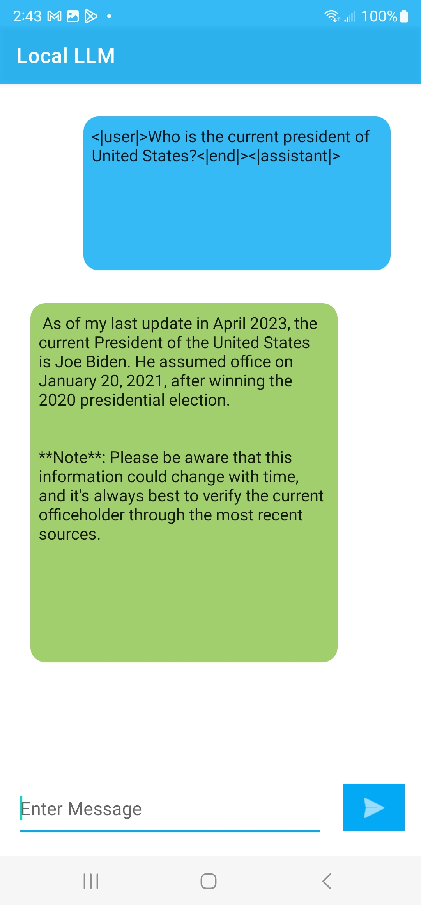
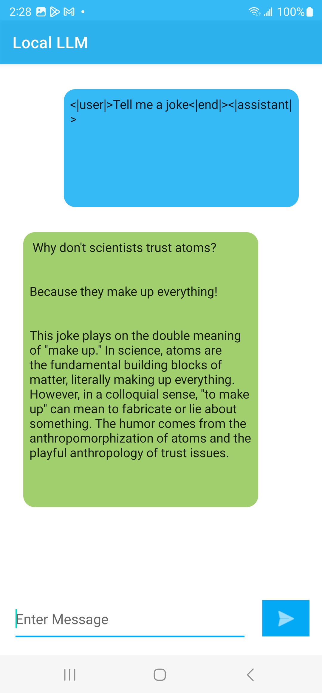
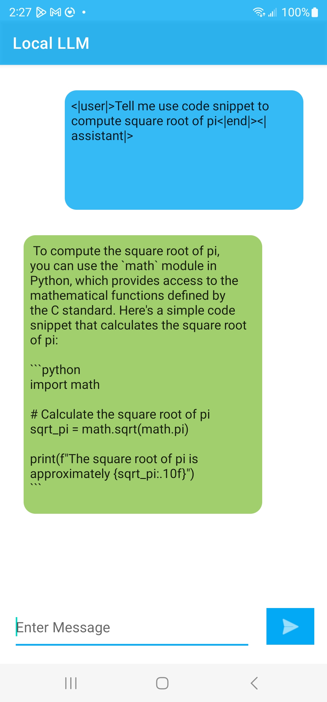

# ONNX Runtime Mobile Phi-3 Android sample application with ORT GenAI library support

## Overview

This is a basic Phi-3 example application for [ONNX Runtime](https://github.com/microsoft/onnxruntime) on Android with [Ort-GenAI](https://github.com/microsoft/onnxruntime-genai) support for running generative AI models . This app demonstrates the usage of phi-3 model in a simple question answering chatbot mode.

### Model
The model used here is from the source: [HuggingFace](https://huggingface.co/microsoft/Phi-3-mini-4k-instruct-onnx#phi-3-mini-4k-instruct-onnx-models)
and optimized for int4 CPU and Mobile usage.

### Requirements
- Android Studio Giraffe | 2022.3.1 or later (installed on Mac/Windows/Linux)
- Android SDK 29+
- Android NDK r22+
- An Android device or an Android Emulator

## Build And Run

### Step 1: Clone the ONNX runtime mobile examples source code

Clone this repository to get the sample application. 

`git@github.com:microsoft/onnxruntime-inference-examples.git`

### Step 2: Prepare the model and required packages

Follow this link to download **Phi-3-mini**: https://huggingface.co/microsoft/Phi-3-mini-4k-instruct-onnx/tree/main/cpu_and_mobile/cpu-int4-rtn-block-32-acc-level-4

The folder is too large to add to the app `assets` folder so we have to manually get it onto the device.

#### TODO: Will update the following instructions to remove the manual copying steps
From Android Studio:
  - create (if necessary) and run your emulator
    - make sure it has at least 8GB of internal storage
  - debug/run the app so it's deployed to the device and creates it's `files` directory
    - expected to be `/data/data/ai.onnxruntime.genai.demo/files`
      - this is the path returned by `getFilesDir()` in MainActivity
    - not sure what triggers the creation of this directory. 
      - if you debug the app and set a breakpoint on the call to create the GenAIWrapper instance in MainActivity.onCreate it should exist when the breakpoint is hit
  - Open Device Explorer in Android Studio
  - Navigate to `/data/data/ai.onnxruntime.genai.demo/files`
    - adjust as needed if the value returned by getFilesDir() differs for your emulator
  - copy the whole phi-2 folder (should be called phi2-int4-cpu) to the `files` directory

### Step 3: Connect Android Device and Run the app
  Connect your Android Device to your computer or select the Android Emulator in Android Studio Device manager.

  Then select `Run -> Run app` and this will prompt the app to be built and installed on your device or emulator.

  Now you can try giving some sample prompt questions and test the chatbot android app by clicking the ">" action button.

#
Here are some sample example screenshots of the app.

