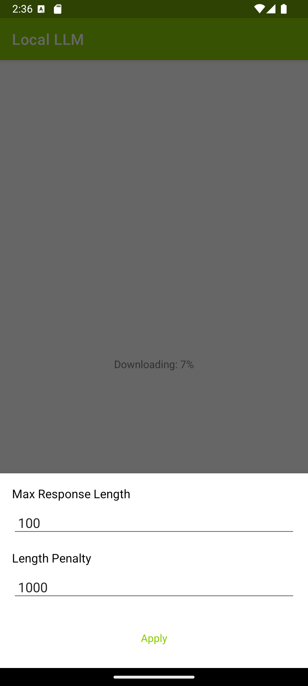

# Local Chatbot on Android with ONNX Runtime Mobile and ONNX Runtime Generate() API

## Overview

This is a flexible Android chatbot application with [ONNX Runtime mobile](https://onnxruntime.ai/docs/tutorials/mobile/) and [ONNX Runtime Generate() API](https://github.com/microsoft/onnxruntime-genai) that supports efficiently running generative AI models. While it uses [Phi-3](https://huggingface.co/microsoft/Phi-3-mini-4k-instruct) by default, **it can work with any ONNX Runtime GenAI compatible model** by simply updating the model configuration in the code.

### Model
By default, this app uses the [ONNX Phi-3 model on HuggingFace](https://huggingface.co/microsoft/Phi-3-mini-4k-instruct-onnx/tree/main/cpu_and_mobile/cpu-int4-rtn-block-32-acc-level-4) with INT4 quantization and optimizations for mobile usage.

### Using Different Models
**The app is designed to work with any ONNX Runtime GenAI compatible model.** To use a different model:

1. Open `MainActivity.java` in Android Studio
2. Locate the model configuration section at the top of the class (marked with comments)
3. Update the `MODEL_BASE_URL` to point to your model's download location
4. Update the `MODEL_FILES` list to include all required files for your model

Example for a different model:
```java
// Base URL for downloading model files (ensure it ends with '/')
private static final String MODEL_BASE_URL = "https://your-model-host.com/path/to/model/";

// List of required model files to download  
private static final List<String> MODEL_FILES = Arrays.asList(
        "config.json",
        "genai_config.json", 
        "your-model.onnx",
        "your-model.onnx.data",
        "tokenizer.json",
        "tokenizer_config.json"
        // Add other required files...
);
```

**Note:** The model files will be downloaded to `/data/data/ai.onnxruntime.genai.demo/files` on the Android device.

### Requirements
- Android Studio Giraffe | 2022.3.1 or later (installed on Mac/Windows/Linux)
- Android SDK 29+
- Android NDK r22+
- An Android device or an Android Emulator

## Build And Run

### Step 1: Clone the ONNX runtime mobile examples source code

Clone this repository to get the sample application. 

`git@github.com:microsoft/onnxruntime-inference-examples.git`

### [Optional] Step 2: Prepare the model

The current set up supports downloading Phi-3-mini model directly from Huggingface repo to the android device folder. However, it takes time since the model data is >2.5G.

You can also follow this link to download **Phi-3-mini**: https://huggingface.co/microsoft/Phi-3-mini-4k-instruct-onnx/tree/main/cpu_and_mobile/cpu-int4-rtn-block-32-acc-level-4
and manually copy to the android device file directory following the below instructions:

#### Steps for manual copying model files to android device directory:
From Android Studio:
  - create (if necessary) and run your emulator/device
    - make sure it has at least 8GB of internal storage
  - debug/run the app so it's deployed to the device and creates it's `files` directory
    - expected to be `/data/data/ai.onnxruntime.genai.demo/files`
      - this is the path returned by `getFilesDir()`
  - Open Device Explorer in Android Studio
  - Navigate to `/data/data/ai.onnxruntime.genai.demo/files`
    - adjust as needed if the value returned by getFilesDir() differs for your emulator or device
  - copy all the required model files (as specified in `MODEL_FILES` in MainActivity.java) directly to the `files` directory
    - For the default Phi-3 model, copy files from [here](https://huggingface.co/microsoft/Phi-3-mini-4k-instruct-onnx/tree/main/cpu_and_mobile/cpu-int4-rtn-block-32-acc-level-4)

### Step 3: Connect Android Device and Run the app
  Connect your Android Device to your computer or select the Android Emulator in Android Studio Device manager.

  Then select `Run -> Run app` and this will prompt the app to be built and installed on your device or emulator.

  Now you can try giving some sample prompt questions and test the chatbot android app by clicking the ">" action button.

#
Here are some sample example screenshots of the app.



