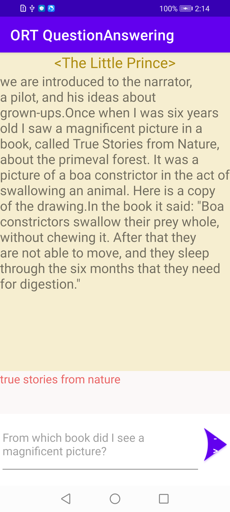
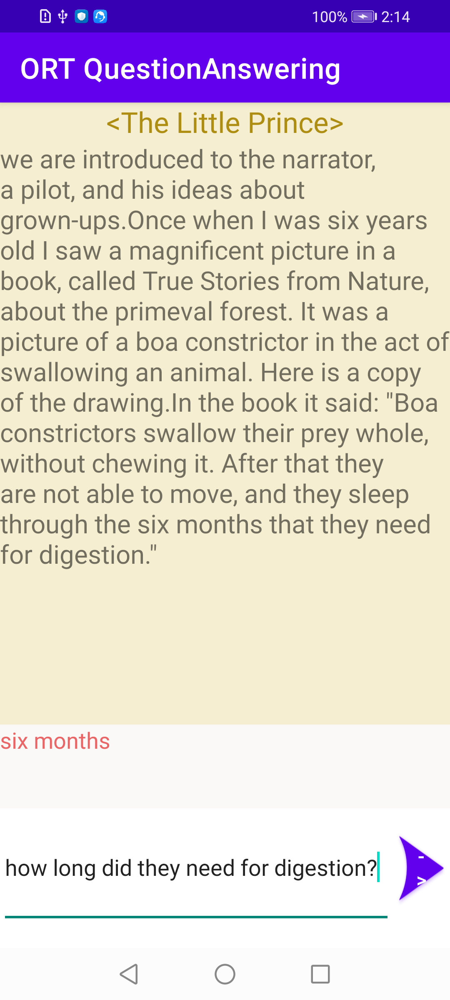

# ONNX Runtime Mobile QuestionAnswering Android sample application with Ort-Extensions support for pre/post processing

## Overview

This is a basic QuestionAnswering example application for [ONNX Runtime](https://github.com/microsoft/onnxruntime) on Android with [Ort-Extensions](https://github.com/microsoft/onnxruntime-extensions) support for pre/post processing. The demo app accomplishes the task of answering the question provided by users.

### Model
The model used here is from the source: [HuggingFace](https://huggingface.co/docs/transformers/model_doc/mobilebert)](https://huggingface.co/docs/transformers/model_doc/mobilebert) and accommodated into [ONNX](https://github.com/onnx/onnx) version with pre/post processing support.


### Requirements
- Android Studio Dolphin | Android Studio Electric Eel | 2022.1.1 Patch 2+ (installed on Mac/Windows/Linux)
- Android SDK 29+
- Android NDK r22+
- An Android device or an Android Emulator


## Build And Run

### Step 1: Clone the ONNX runtime mobile examples source code

Clone this repository to get the sample application. 

`git@github.com:microsoft/onnxruntime-inference-examples.git`


### Step 2: Prepare the model and required packages

- The model used is under `mobile\examples\question_answering\android\app\src\main\res\raw`.

`prepare_models.py` in the directory will do the model-preparing work. The whole procedure includes four steps.
1. download model from huggingface. 
2. convert model to onnx. 
3. quantize onnx model. 
4. add pre/post processing to onnx model.

NOTE: Please install onnxruntime-extensions package following [this](https://github.com/microsoft/onnxruntime-extensions) according to your platform.

This script works for both Mac and Linux by default. If you want to work it in windows, you should prepare the environment by yourself and run `prepare_models.py` in windows.

Model will be placed at `mobile\examples\question_answering\android\app\src\main\res\raw` automatically.

```bash
cd mobile/examples/question_answering/android
bash prepare_models.sh
```


### Step 3: Connect Android Device and Run the app
  Connect your Android Device to your computer or select the Android Emulator in Android Studio Device manager.

  Then select `Run -> Run app` and this will prompt the app to be built and installed on your device or emulator.

  Now you can try and test the question answering android app by clicking the ">" action button.

#
Here are some sample example screenshots of the app.




