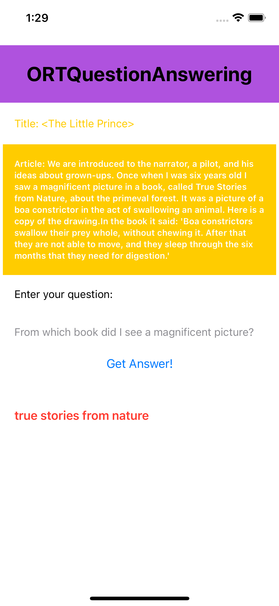
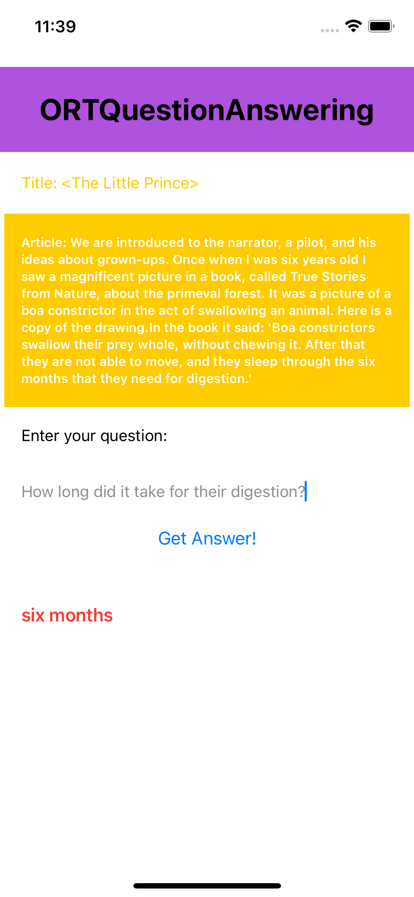

# ONNX Runtime Mobile Question Answering iOS sample application with Ort-Extensions support for pre/post processing

## Overview

This is a basic Question Answering example application for [ONNX Runtime](https://github.com/microsoft/onnxruntime) on iOS with [Ort-Extensions](https://github.com/microsoft/onnxruntime-extensions) support for pre/post processing. The demo app accomplishes the task of basic QA, i.e. gives answers based on user provided context.

The model used here is from source: [HuggingFace](https://huggingface.co/docs/transformers/model_doc/mobilebert) and accomodated into [ONNX](https://github.com/onnx/onnx) version with pre/post processing support.

## Requirements
- Install Xcode 13.0 and above (preferably latest version)
- A valid Apple Developer ID
- An iOS device or iOS simulator
- Xcode command line tools `xcode-select --install`
- Clone the `onnxruntime-inference-examples` source code repo

## Build And Run

1. Install CocoaPods. `sudo gem install cocoapods`

2. In terminal, run `pod install` under `<onnxruntime-inference-example-root>/mobile/examples/question_answering/ios/` to generate the workspace file and install required pod files.
   
   Note: At the end of this step, you should get a file called `ORTQuestionAnswering.xcworkspace`.

3. Prepare the required model used in this sample.
    
    Use provided `prepare_model.py` script under `mobile/examples/question_answering/android/` to do the model-preparing work. The whole procedure includes four steps.
    1. download model from huggingface. 
    2. convert model to onnx. 
    3. quantize onnx model. 
    4. add pre/post processing to onnx model.

    Note: See more information in `mobile/examples/question_answering/android/README.md`.

    ```bash
    cd mobile/examples/question_answering/android
    bash prepare_models.sh
    ```
    Note: Currently the model is already provided under `mobile/examples/question_answering/ios/ORTQuestionAnswering/ORTQuestionAnswering/csarron_mobilebert_uncased_squad_v2_quant_with_pre_post_processing.onnx`

4. Open `<ONNXRuntime-inference-example-root>/mobile/examples/question_answering/ios/ORTQuestionAnswering.xcworkspace` in Xcode and make sure to select your corresponding development team under `Target-General-Signing` for a proper codesign procedure to run the app (only on device required, if running on iOS simulator can skip this step.)

5. Connect your iOS device/simulator, build and run the app. Click `Get Answers!` button to see performed answer based on the given context. A default hint message will be displayed on initial screen.

#
Here's an example screenshot of the app:



