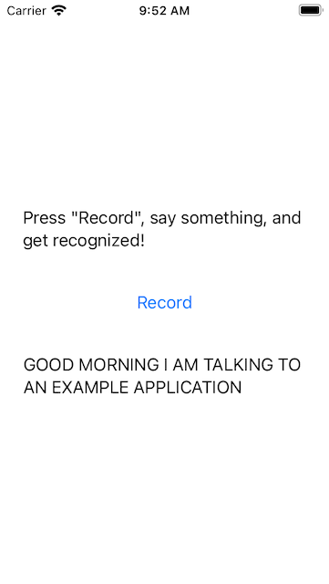

# iOS Speech Recognition Example

This example shows how to use ORT to do speech recognition using the [Wav2Vec 2.0](https://huggingface.co/transformers/model_doc/wav2vec2.html) model.

It is heavily inspired by [this PyTorch example](https://github.com/pytorch/ios-demo-app/tree/f2b9aa196821c136d3299b99c5dd592de1fa1776/SpeechRecognition).

The application lets the user make an audio recording, then recognizes the speech from that recording and displays a transcript.



## Set up

### Prerequisites

See the general prerequisites [here](../../../README.md#General-Prerequisites).

Additionally, you will need to be able to record audio, either on a simulator or a device.

### Generate the model

The model should be generated in this location: `<this directory>/SpeechRecognition/model`

See instructions [here](../model/readme.md) for how to generate the model.

For example, with the model generation script dependencies installed, from this directory, run:

```bash
../model/gen_model.sh ./SpeechRecognition/model
```

### Install the Pod dependencies

From this directory, run:

```bash
pod install
```

## Build and run

Open the generated SpeechRecognition.xcworkspace file in Xcode to build and run the example.
