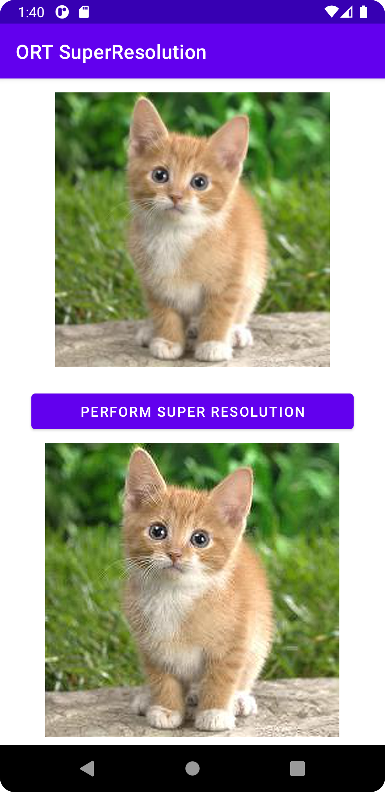
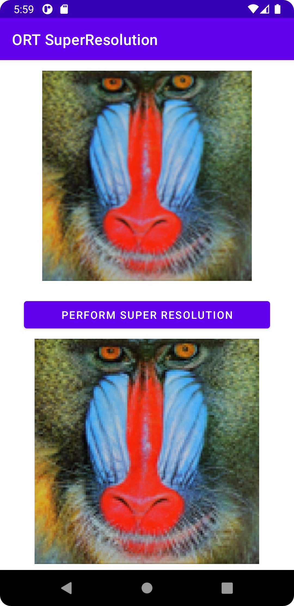

# ONNX Runtime Mobile Super Resolution Android sample application with Ort-Extensions support for pre/post processing

## Overview

This is a basic Super Resolution example application for [ONNX Runtime](https://github.com/microsoft/onnxruntime) on Android with [Ort-Extensions](https://github.com/microsoft/onnxruntime-extensions) support for pre/post processing. The demo app accomplishes the task of recovering a high resolution (HR) image from its low resolution counterpart.

The model used here is from source: [Pytorch Super Resolution](https://pytorch.org/tutorials/advanced/super_resolution_with_onnxruntime.html) and accomodated into [ONNX](https://github.com/onnx/onnx) version with pre/post processing support.

### Requirements
- Android Studio Dolphin | 2021.3.1 Patch + (installed on Mac/Windows/Linux)
- Android SDK 29+
- Android NDK r22+
- An Android device or an Android Emulator

### Steps to build and run

### Step 1: Clone the ONNX runtime mobile examples source code

Clone this repository to get the sample application. Then open the project under folder `mobile\examples\super_resolution\android`.

### Step 2: Prepare the model and required packages

- The required aar package is under lib's folder `mobile\examples\super_resolution\android\app\libs`.
- The model used is under `mobile\examples\super_resolution\android\app\src\main\res\raw`.

Note: When update to pre-release/release version ort-extensions android package, it will no longer consume a local AAR package that's included in this repo.

### Step 3: Connect Android Device and Run the app
  Connect your Android Device to your computer or select the Android Emulator in Android Studio Device manager.

  Then select `Run -> Run app` and this will prompt the app to be built and installed on your device or emulator.

  Now you can try and test the super resolution android app by clicking the perform action button.

#
Here are some sample example screenshots of the app.

