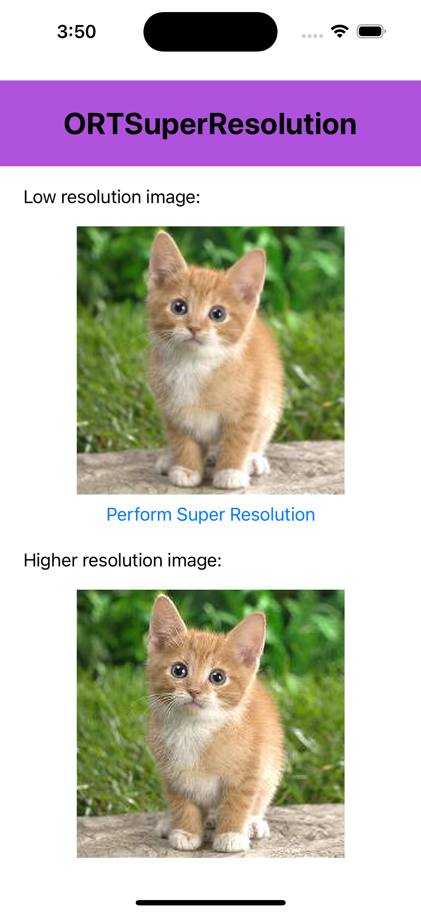

# ONNX Runtime Mobile Super Resolution iOS sample application with Ort-Extensions support for pre/post processing

## Overview

This is a basic Super Resolution example application for [ONNX Runtime](https://github.com/microsoft/onnxruntime) on iOS with [Ort-Extensions](https://github.com/microsoft/onnxruntime-extensions) support for pre/post processing. The demo app accomplishes the task of recovering a high resolution (HR) image from its low resolution counterpart.

The model used here is from source: [Pytorch Super Resolution](https://pytorch.org/tutorials/advanced/super_resolution_with_onnxruntime.html) and accomodated into [ONNX](https://github.com/onnx/onnx) version with pre/post processing support.

## Requirements
- Install Xcode 13.0 and above (preferably latest version)
- A valid Apple Developer ID
- An iOS device or iOS simulator
- Xcode command line tools `xcode-select --install`
- Clone the `onnxruntime-inference-examples` source code repo

## Build And Run

1. Install CocoaPods. `sudo gem install cocoapods`

2. In terminal, run `pod install` under `<ONNXRuntime-inference-example-root>/mobile/examples/super_resolution/ios/ORTSuperResolution` to generate the workspace file and install required pod files.
   
   Note: At the end of this step, you should get a file called `ORTSuperResolution.xcworkspace`.

3. Open `<ONNXRuntime-inference-example-root>/mobile/examples/super_resolution/ios/ORTSuperResolution.xcworkspace` in Xcode and make sure to select your corresponding development team under `Target-General-Signing` for a proper codesign procedure to run the app (only on device required, if running on iOS simulator can skip this step.)

4. Connect your iOS device/simulator, build and run the app. Click `Perform Super Resolution` button to see performed result on displayed sample image.

#
Here's an example screenshot of the app:

