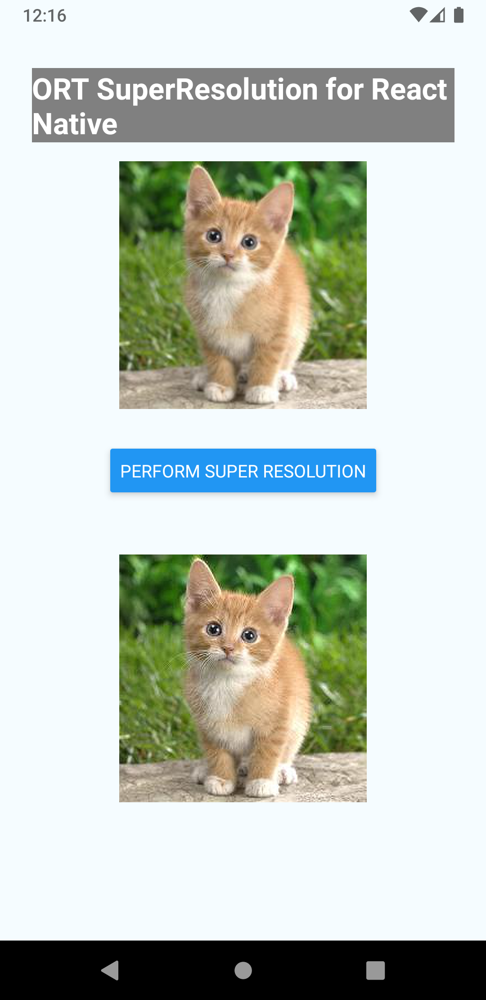
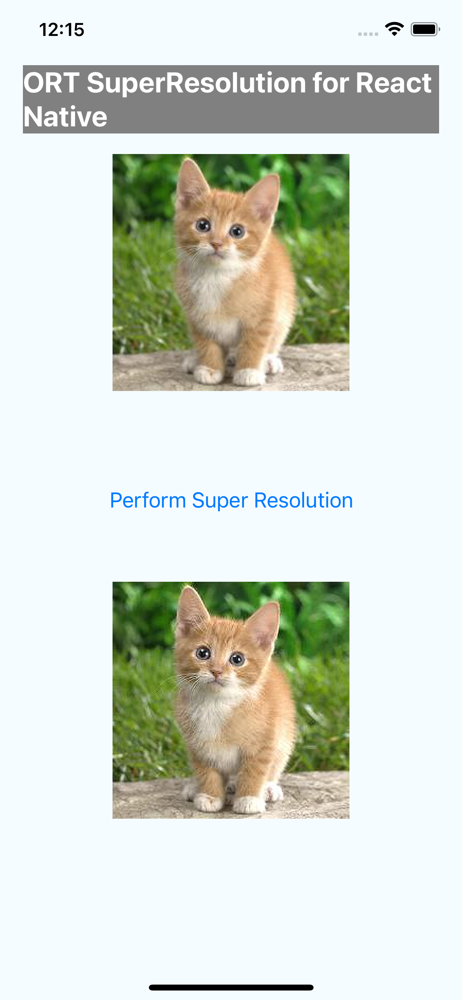

# ONNX Runtime Super Resolution Sample React Native Application with ort-extensions

## Overview

This is a basic Super Resolution example React Native Application using [Expo framework](https://docs.expo.dev/) for [ONNX Runtime](https://github.com/microsoft/onnxruntime) with [Ort-Extensions](https://github.com/microsoft/onnxruntime-extensions) support for pre/post processing. The demo app accomplishes the task of recovering a high resolution (HR) image from its low resolution counterpart and can run on both Android and iOS platform.

0. Prepare environment
    1. install Node.js
        - Node.js (16.0+): <https://nodejs.org/>
    2. install expo

        ```sh
        npm install -g expo-cli
        ```

    3. install yarn

        ```sh
        npm install -g yarn
        ```

1. Setup empty project

   ```sh
   cd <SOURCE_ROOT>
   expo init . -t expo-template-blank-typescript
   yarn
   ```

   NOTE:
   - `<SOURCE_ROOT>` refers to the root folder of the source code, where this `README.md` file sits.
   i.e. `mobile/examples/super_resolution/react_native/ort-super-resolution/`

2. Install onnxruntime-react-native

    ```sh
    expo install onnxruntime-react-native@dev
    ```

    NOTE: `@dev` will automatically install the latest dev version of onnxruntime-react-native package. Currently, the latest support is only included in the dev version package.
    When available, just need to install the latest released version package. for instance, `expo install onnxruntime-react-native@1.15.0`

3. Add your ONNX model to project

    1. Put the file under `<SOURCE_ROOT>/assets`.

       In this tutorial, we use `pytorch_superresolution_with_pre_post_processing_opset18.onnx` which is originally from source: [Pytorch Super Resolution](https://pytorch.org/tutorials/advanced/super_resolution_with_onnxruntime.html) and accomodated into [ONNX](https://github.com/onnx/onnx) version with pre/post processing support.

       The model is currently provided under directory `mobile/examples/super_resolution/`.

    2. add a new file `metro.config.js` under `<SOURCE_ROOT>` and add the following lines to the file:

       ```js
       const { getDefaultConfig } = require('@expo/metro-config');
       const defaultConfig = getDefaultConfig(__dirname);
       defaultConfig.resolver.assetExts.push('onnx');
       module.exports = defaultConfig;
       ```

       This step adds extension `onnx` to the bundler's asset extension list, which allows the bundler to include the model into assets.

4. Setup Android and iOS project.

    We use expo prebuild steps to generate Android/iOS projects folder to consume ONNX Runtime and Ort-Extensions.

    - Use NPM package `onnxruntime-react-native` as an expo plugin. (Recommended way)
        1. In `<SOURCE_ROOT>/app.json`, add the following line to section `expo`:

           ```
           "plugins": ["onnxruntime-react-native"],
           ```

        2. Run the following command in `<SOURCE_ROOT>` to generate Android and iOS project:

            ```sh
            expo prebuild
            ```

        The `android/` and `ios/` project files will be generated automatically after this step.

5. Enable Ort Extensions in React Native app.
   1. In `<SOURCE_ROOT>/package.json` file, specify the field to build expo project with ort-extensions package:

        ```
        "onnxruntimeExtensionsEnabled": "true"
        ```

    Note: This will enable the project to build and run based on the configuration including all pre/processing support
    from ONNX Runtime Extensions.

6. Run the following command to launch:

    In `<SOURCE_ROOT>`, run the following command to launch for Android

    ```sh
    expo run:android
    ```

    In `<SOURCE_ROOT>`, run the following command to launch for iOS

    ```sh
    expo run:ios
    ```

NOTE: For this sample application, minSDK version used in the android project is 24 and target iOS deployment target platform version is 12.4. Please adjust accordingly otherwise may cause build failure when launching the app.

## References:

[ONNX Runtime React Native Library](https://github.com/microsoft/onnxruntime/tree/main/js/react_native#onnxruntime-react-native)

[onnxruntime-react-native](https://github.com/microsoft/onnxruntime/tree/main/js#onnxruntime-react-native)

[Get Started with ONNX Runtime for React Native](https://onnxruntime.ai/docs/get-started/with-javascript.html#onnx-runtime-for-react-native)

#

Here's some example screenshots of the app:

Android:



iOS:


