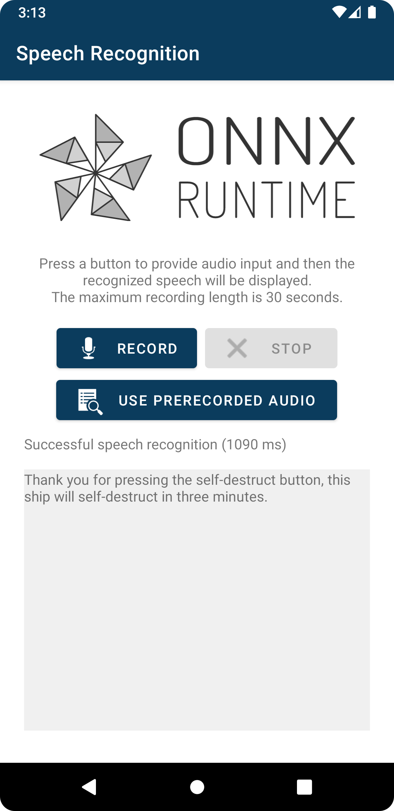

# Android Speech Recognition Example with Azure Custom Op

This example shows how to use ORT to do speech recognition using the [Whisper](https://github.com/openai/whisper) model and calls the OpenAI Whisper endpoint using the Azure custom op. You MUST update the code to specify a valid OpenAI auth token. See [here](#prepare-an-openai-auth-token) for details.

The application lets the user make an audio recording, then recognizes the speech from that recording and displays a transcript.

Example App Screenshot - A Successful result returned from OpenAI endpoint:

## Set up

### Prerequisites

See the general prerequisites [here](../../../../README.md#General-Prerequisites).

A pre-recorded audio file is provided in the app to simplify usage, and you can also record audio if you choose. 

This example was developed with Android Studio Giraffe | 2022.3.1 Patch 1.
It is recommended to use that version or a newer one.

### Generate the model

This is optional. Currently a model generated by the [create_openai_whisper_transcriptions.py](https://github.com/microsoft/onnxruntime-extensions/blob/main/test/data/azure/create_openai_whisper_transcriptions.py) script is checked in. If any changes are required they should only be simple adjustments. (e.g. change default audio format from wav to mp3).

Copy the model to `app/src/main/res/raw/openai_whisper_transcriptions.onnx`.

### Prepare an OpenAI Auth Token

It's required for the app to provide an OpenAI auth token. Please update the authToken variable in `SpeechRecognizer init` (app/src/main/java/ai/onnxruntime/example/whisperAzure/SpeechRecognizer.kt) with your token.

For local testing, you should be able to create an account with API key and initial free credits.

[OpenAI authentication](https://platform.openai.com/docs/plugins/authentication)
## Build and run

Open this directory in Android Studio to build and run the example.
