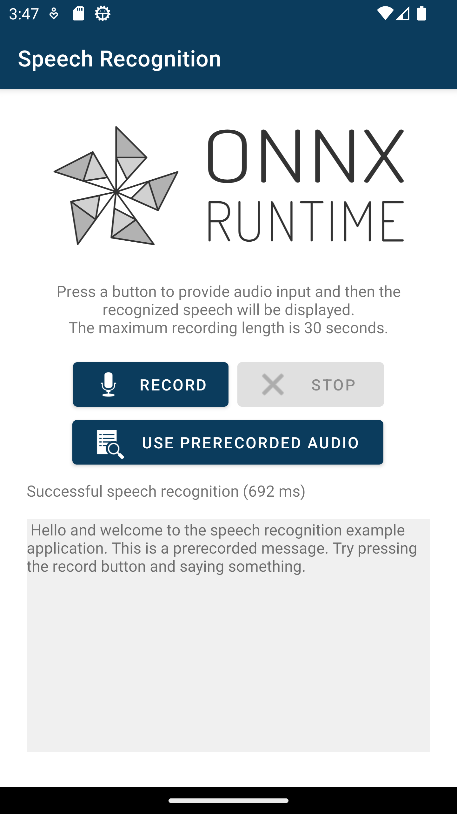

# Android Speech Recognition Example

This example shows how to use ORT to do speech recognition using the [Whisper](https://github.com/openai/whisper) model.

The application lets the user make an audio recording, then recognizes the speech from that recording and displays a transcript.

## Set up

### Prerequisites

See the general prerequisites [here](../../../../README.md#General-Prerequisites).

Optionally, you will need to be able to record audio, either on an emulator or a device. In the example, a pre-recorded audio is provided.

This example was developed with Android Studio Flamingo 2022.2.1 Patch 1.
It is recommended to use that version or a newer one.

### Generate the model

This is optional. Currently a usable model file is checked in.

Follow the instructions to generate the model with Olive [here](https://github.com/microsoft/Olive/tree/main/examples/whisper).
- The model name is `openai/whisper-tiny.en`.
- The configuration used is for CPU and INT8.
- Use the `--no_audio_decoder` option as we don't need the audio decoder in the model in this application.

Copy the model to `app/src/main/res/raw/whisper_cpu_int8_model.onnx`.

Note: The checked in model was generated with Olive [0.3.1](https://github.com/microsoft/Olive/releases/tag/v0.3.1).

## Build and run

Open this directory in Android Studio to build and run the example.
